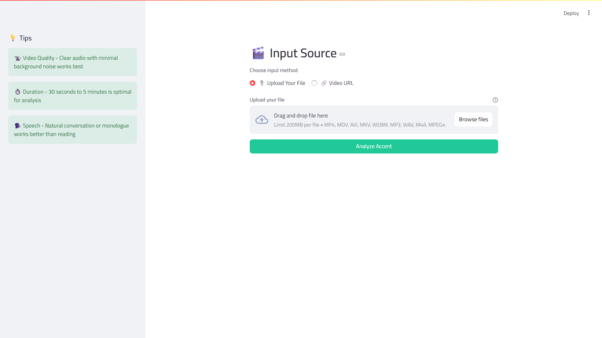
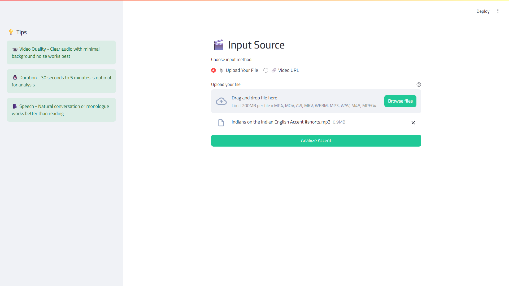
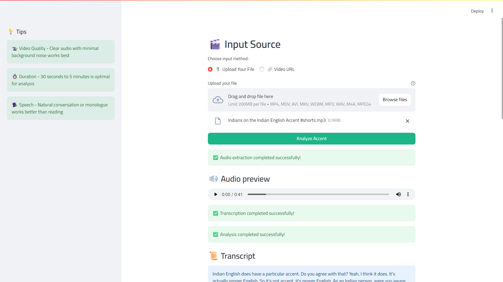
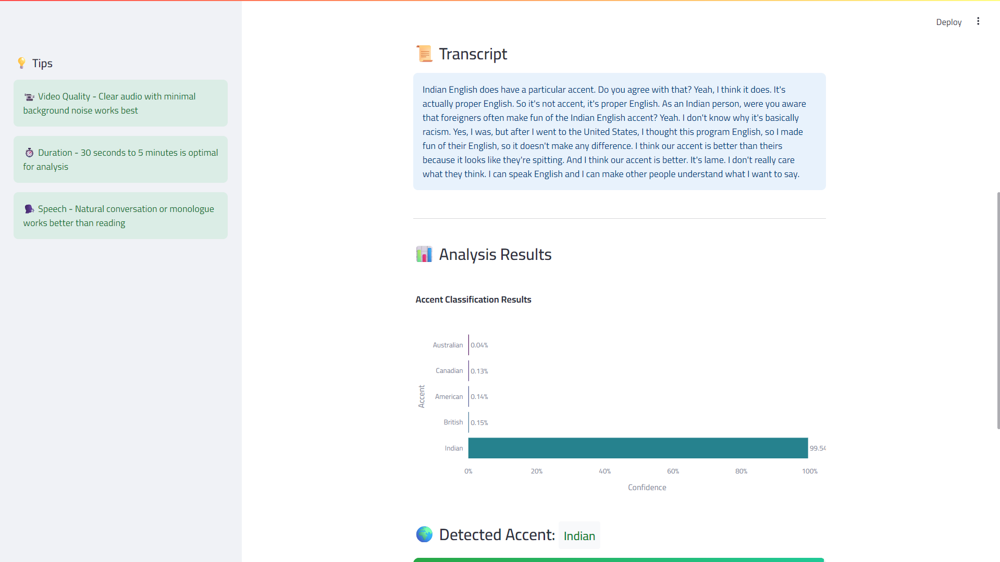
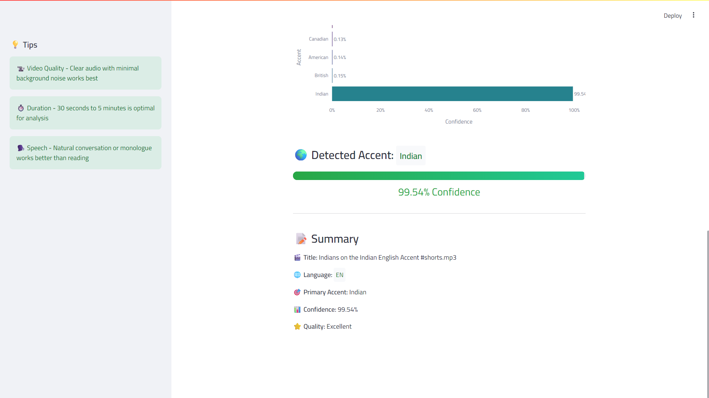

# 🎙️ Accent Detective

**Accent Detective** is a Streamlit-based application that detects if spoken language is English and then classifies the speaker's English accent from audio or video files. It uses OpenAI's Whisper for transcription and a Hugging Face model for accent classification.

---

## 🚀 Features

- 🎧 **Audio/Video Support**: Accepts direct file uploads or video URLs (YouTube, Loom, etc.)
- 🧠 **AI-Powered Transcription**: Uses OpenAI Whisper to convert speech to text
- 🌎 **Accent Detection**: Classifies into one of five English accents:
  - American 🇺🇸
  - British 🇬🇧
  - Canadian 🇨🇦
  - Australian 🇦🇺
  - Indian 🇮🇳
- 📊 **Interactive Visualizations**: Displays accent confidence scores using Plotly charts
- ✅ **Confidence Bars**: Visual indicator of classification certainty

---

## 🧠 Models Used

| Task                  | Model                                                                 |
|-----------------------|-----------------------------------------------------------------------|
| Transcription         | [`openai/whisper-base`](https://github.com/openai/whisper)           |
| Accent Classification | [`dima806/english_accents_classification`](https://huggingface.co/dima806/english_accents_classification) |

---

## 🛠️ Installation

### 1. Clone the repository
```bash
git clone https://github.com/MohammedAly22/Accent-Detective.git
cd accent-detective
```

### 2. Create and activate a virtual environment (optional but recommended)
```bash
python -m venv venv
source venv/bin/activate  # On Windows use `venv\Scripts\activate`
```

### 3. Install dependencies
```bash
pip install -r requirements.txt
```

### 4. Run the streamlit application
```bash
streamlit run app.py
```
---

## 📦 Requirements
- Python `3.8+`
- `ffmpeg` (required by `yt-dlp` and `librosa`)

---
## 📁 Project Structure
```bash
.
├── app.py                  # Main Streamlit UI
├── accent_detector.py      # Core logic for transcription and accent detection
├── utils.py                # Visualization and helper functions
├── style.css               # Custom styling
├── requirements.txt        # Python dependencies
└── README.md               # Project documentation
```

---
## 📷 Usage

Run the app locally:
```bash
streamlit run app.py
```

You should expect to see this interface:


---
## ✨ Example

1. Upload a `.wav`, `.mp4`, `.m4a`, etc. or paste a YouTube URL.



2. Click “Analyze Accent”.

3. View transcript, detected language, accent prediction, and confidence scores.





---

## 🧪 Supported Formats

- Video: `.mp4`, `.mov`, `.avi`, `.mkv`, `.webm`

- Audio: `.mp3`, `.wav`, `.m4a`

---
## ⚙️ Tech Stack
- `Streamlit`

- `OpenAI Whisper`

- `Hugging Face Transformers`

- `yt-dlp`

- `Plotly`

- `librosa`

---
## ⚠️ Limitations
- Only works with English speech for accent classification.

- Accuracy may drop for noisy audio or very short clips (< 10 sec).

---
## 💬 Have Questions?
Reach out on GitHub or open an issue!

---
🎯 Accent Detector - Your Intelligent English Accent Detector! 🎙️
